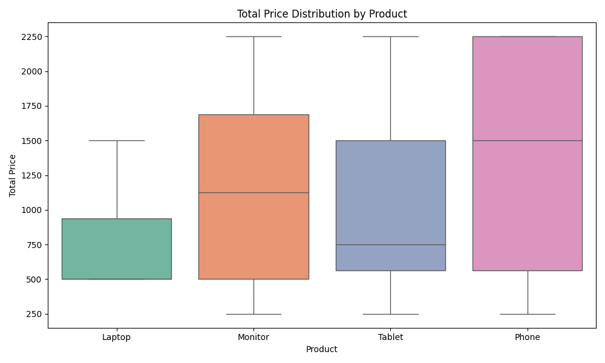

# ETL Midterm Project

**Student:** Faith Chakwanira  
**ID:** 670435

---

## Project Overview
This project demonstrates the ETL (Extract, Transform, Load) process using a sample sales dataset. The goal is to extract raw and incremental data, apply meaningful transformations, and load the cleaned data into structured formats for analysis. The project is organized for clarity, reproducibility, and GitHub hygiene.

---

## ETL Phases
### 1. Extract (`etl_extract.md`)
- Loads and previews `raw_data.csv` and `incremental_data.csv`.
- Displays `.head()` and `.info()` for each dataset.
- Observes and documents missing values, duplicates, and suspicious columns.

### 2. Transform (`etl_transform.md`)
- Removes duplicate rows.
- Handles missing values in key columns.
- Adds a `total_price` column (quantity × unit_price).
- Converts `order_date` to datetime format.
- Extracts the order month for trend analysis.
- Saves transformed data to the `transformed/` folder.

### 3. Load (`etl_load.md`)
- Loads transformed data into both SQLite and Parquet formats.
- Previews the first 5 rows from each storage format.
- Saves preview outputs in the `loaded/` folder for verification.

---

## Tools Used
- **Python 3**
- **Pandas** (data manipulation and analysis)
- **SQLite3** (lightweight database)
- **Parquet** (efficient columnar storage)
- **Jupyter Notebook / Markdown** (documentation and code organization)

---

## How to Run the Project
1. **Clone the repository** and navigate to the project folder.
2. Ensure you have Python 3 and the required packages installed:
   ```bash
   pip install pandas pyarrow
   ```
3. Follow the steps in each markdown file (`etl_extract.md`, `etl_transform.md`, `etl_load.md`):
   - Run the code blocks in order.
   - Review and edit markdown explanations as needed.
4. Check the `transformed/` and `loaded/` folders for output files.
5. Preview files (e.g., open the preview CSVs in `loaded/` to verify results).

---

## Screenshot or Chart

### 1. Number of Orders per Region

*This bar chart shows the distribution of orders across different regions, highlighting which regions have the highest and lowest sales activity.*

### 2. Total Price Distribution by Product

*This boxplot visualizes the spread and central tendency of total sales price for each product type, helping to identify products with higher price variability or outliers.*

### 3. Number of Orders per Month

*This line plot displays the trend of order counts over different months, revealing any seasonality or monthly sales patterns in the dataset.*

---

 